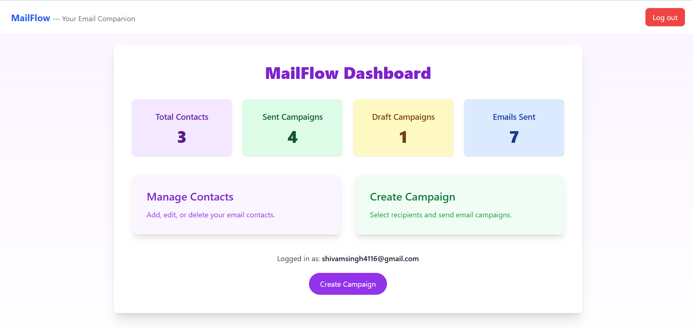
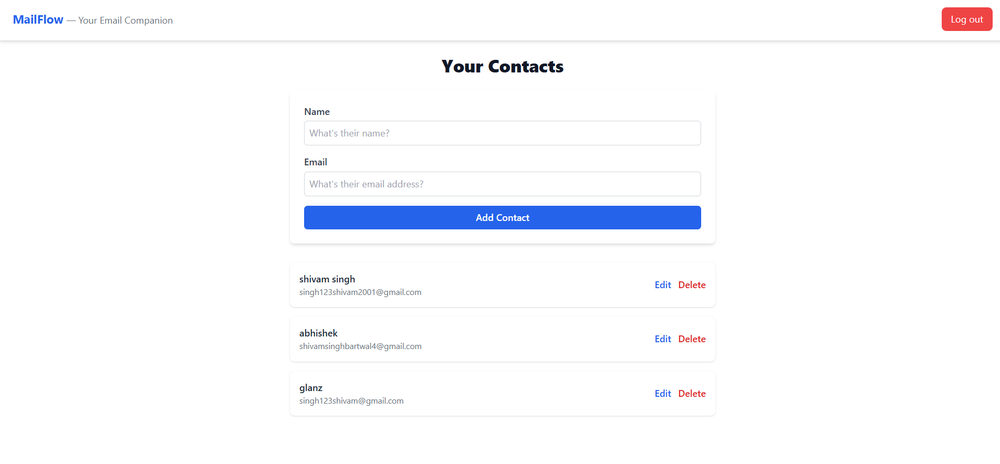
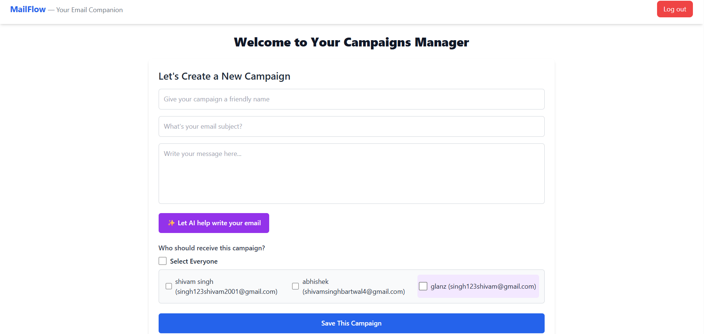

# 📧 MailFlow

MailFlow is a React + TypeScript web application designed for managing contacts, creating email campaigns, and sending emails using Nodemailer.  
This README documents **Phase 1** of the project.

---

## 🚀 Phase 1 Overview
In Phase 1, the following features were implemented:

- **Login Page** – Secure user login with form validation.
- **Register Page** – New user registration with proper input validation.
- **Dashboard** – Central place to view and navigate project features.
- **Contacts Page** – Add, view, and manage contacts.
- **Campaigns Page** – Create and manage email campaigns.

---

## 🛠 Tech Stack
- **Frontend**: React (TypeScript), TailwindCSS
- **Backend**: Node.js, Express.js
- **Email Service**: Nodemailer
- **Database**: MongoDB
- **Styling**: TailwindCSS

---

## 📂 Folder Structure
```plaintext
mailflow/
│
├── backend/
│   ├── src/
│   │   ├── controllers/    # Route handlers(contact , auth , campaigns)
│   │   ├── models/         # Database models(contact , auth , campaigns)
│   │   ├── routes/         # API endpoints(contact , auth , campaigns)
│   │   ├── services/       # sercice code(mailservice)
│   ├── server.js           # main server.js 
│   ├── .env                # Environment variables
│   ├── package.json
│
├── frontend/
│   ├── src/
|   |   ├── api/            # apiInstance
│   │   ├── components/     # Reusable UI components
│   │   ├── pages/          # Pages (Login, Dashboard, etc.)
│   │   ├── App.tsx
│   │   ├── index.tsx
│   │
│   ├── tailwind.config.js
│   ├── package.json
├── .env
├── screenshots/            # Screenshots for README
└── README.md

## 📸 Screenshots (Phase 1)

### 🔐 Login Page


### 📝 Register Page


### 📊 Dashboard


### 📇 Contacts Page


### 📢 Campaigns Page



---

## ⚙️ Installation & Setup

### 1️⃣ Clone the repository
```bash
git clone https://github.com/your-username/mailflow.git
cd mailflow
